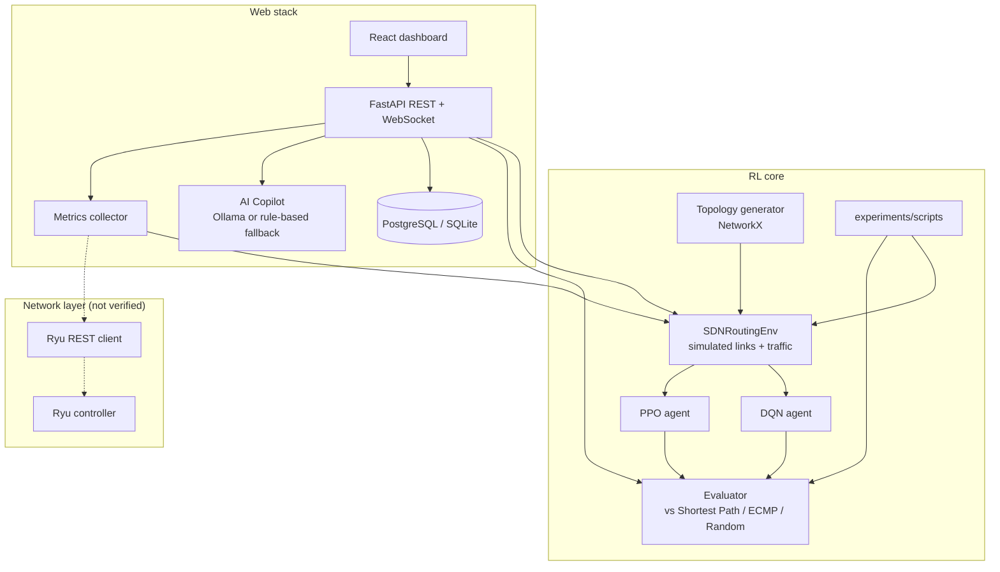

# RL-SDN Traffic Engineering

Reinforcement-learning agents (DQN and PPO) that choose routing paths for flows in a simulated
software-defined network, plus a FastAPI backend and React dashboard around them.

> 🚧 **Work in progress.**
> The simulated environment, the agents, the backend and the dashboard run, and the backend tests
> pass. The [first experiment](experiments/first_experiment/README.md) found that the trained agents
> do no better than random routing on the current reward, which needs to be redesigned. There is no
> integration with a live network (Ryu controller, OpenFlow switches, Mininet) yet.
> See [STATUS.md](STATUS.md) for exactly what was checked.

[](https://github.com/amirhosseinkho/RL-SDN-Traffic-Engineering/actions)
[](https://www.python.org/downloads/)
[](LICENSE)

---

## What the project does today

1. A topology generator builds a NetworkX graph (linear, tree, fat-tree, spine-leaf or custom JSON).
2. `SDNRoutingEnv` (a Gymnasium environment) simulates link utilization, queueing, latency and
   packet loss on that graph, from a randomly generated and randomly perturbed set of flows.
3. At each step, a DQN or PPO agent picks one of the K shortest paths for every flow, and the
   environment returns a reward built from link utilization, latency, congestion and loss.
4. An evaluator compares trained agents with shortest-path, ECMP and random routing in the same
   simulation, on the same traffic.
5. A FastAPI backend and a React dashboard let you create topologies, watch simulated link metrics,
   start training runs and compare agents.

All of this runs inside the simulation. No routing decision is installed on real or emulated switches.

---

## Architecture

Solid arrows are code paths that have been run (see [STATUS.md](STATUS.md)). Dashed arrows are
code that exists but has not been run against a real controller.



The metrics collector reads from Ryu when a controller is reachable. Otherwise it simulates the
active topology, and that is what the Live Metrics page shows. There is no Mininet integration in
the code.

---

## Project Structure

```
RL-SDN-Traffic-Engineering/
├── backend/
│   ├── app/
│   │   ├── config.py               # Settings (pydantic-settings)
│   │   ├── main.py                 # FastAPI app factory + lifespan
│   │   ├── api/
│   │   │   ├── routes/             # topology, metrics, flows, rl, reports, copilot
│   │   │   └── websocket.py        # /ws/metrics, /ws/training/{session_id}
│   │   ├── controller/
│   │   │   ├── ryu_controller.py   # Async HTTP client for Ryu's REST API
│   │   │   └── openflow_handler.py # Ryu app (OpenFlow 1.3, L2 learning); runs under ryu-manager
│   │   ├── database/               # SQLAlchemy models, Pydantic schemas, session
│   │   ├── monitoring/
│   │   │   └── collector.py        # Metrics from Ryu, or from a simulation of the active topology
│   │   ├── rl/
│   │   │   ├── environment.py      # SDNRoutingEnv (Gymnasium)
│   │   │   ├── trainer.py          # DQN and PPO training loops, seeding
│   │   │   └── agents/
│   │   │       ├── dqn_agent.py    # Dueling Double DQN, uniform replay buffer
│   │   │       └── ppo_agent.py    # PPO (clipped objective, GAE-Lambda)
│   │   ├── simulation/
│   │   │   ├── traffic_generator.py # Traffic patterns (standalone, not used by the env)
│   │   │   └── evaluator.py         # Agents vs shortest path / ECMP / random
│   │   └── topology/
│   │       └── generator.py        # Linear, tree, fat-tree, spine-leaf, custom JSON
│   ├── tests/
│   │   ├── unit/                   # pytest unit tests
│   │   └── integration/            # API tests (in-memory SQLite)
│   ├── requirements.txt
│   └── Dockerfile
├── frontend/
│   ├── eslint.config.js
│   └── src/
│       ├── components/             # TopologyGraph, TrainingChart, MetricsCards, Sidebar
│       ├── pages/                  # 8 dashboard pages
│       ├── services/               # REST + WebSocket clients
│       ├── store/                  # Zustand store
│       └── types/
├── experiments/
│   ├── first_experiment/           # run.sh, aggregate.py, results and write-up
│   └── scripts/
│       ├── train_dqn.py
│       ├── train_ppo.py
│       └── evaluate.py
├── models/                         # Trained weights are written here (git-ignored)
├── docs/                           # architecture.md, training.md
├── STATUS.md                       # What has been verified
├── docker-compose.yml
└── .github/workflows/ci.yml
```

---

## Features

### Implemented and verified
Exercised by the tests, by running the scripts, or by using the dashboard (see [STATUS.md](STATUS.md)).

- **Topology generator**: linear, tree, fat-tree (k-port), spine-leaf and custom JSON topologies,
  with per-link bandwidth, latency and loss attributes.
- **`SDNRoutingEnv`** (Gymnasium API):
  - *State*: per-link utilization, latency, packet loss and queue occupancy; per-flow demand and
    active flag; global average/max utilization and congestion ratio.
  - *Action*: multi-discrete, one of the K shortest paths (K = 4 by default) per flow.
  - *Reward*: `w_t·throughput_gain − w_l·latency − w_c·congestion − w_p·packet_loss`, where
    `throughput_gain` is based on average link utilization.
  - Traffic is synthetic: about 20% elephant flows, random demand perturbations and bursts.
- **DQN agent**: dueling network, Double-DQN targets, uniform experience replay, epsilon-greedy
  exploration, checkpointing.
- **PPO agent**: shared trunk with one policy head per flow, value head, GAE-Lambda advantages,
  clipped surrogate objective.
- **Reproducible runs**: `--seed` seeds Python, NumPy, PyTorch and the simulated traffic;
  `--output-dir` chooses where models are saved.
- **Evaluation** against shortest-path, ECMP and random routing, written to JSON.
- **FastAPI backend**: REST routes for topologies, metrics, flows, training sessions, evaluation,
  reports (JSON, CSV, PDF) and the copilot; a WebSocket stream for live metrics.
- **React dashboard**: Topology, Live Metrics, RL Training, Training Progress and Evaluation pages
  were used against the running backend.
- **AI Copilot**: sends questions to an Ollama model, and falls back to fixed keyword-based answers
  (labelled `rule-based`) when Ollama is unavailable. Only the fallback has been tested.

### Implemented but not verified
- **Ryu integration**: an async client for Ryu's REST API (topology, flow and port stats) and an
  OpenFlow 1.3 Ryu app with L2 learning and LLDP-based topology discovery. Not run against a controller.
- **Active Flows, Reports and AI Copilot pages** of the dashboard: their API endpoints were tested,
  but the pages themselves were not opened.
- **Training-progress WebSocket** (`/ws/training/{session_id}`): the dashboard reads training
  progress from the REST API instead, so this stream has not been used.
- **Docker images** and `docker compose up`.

### Planned
- A reward function based on per-flow outcomes (see the [first experiment](experiments/first_experiment/README.md)).
- Installing the agents' routing decisions on switches (the `install_path` helpers exist but are
  not called).
- Emulating the network in Mininet and training/evaluating against it.

---

## Quick Start

Tested on Ubuntu 24.04 (WSL2) with Python 3.12.3 and Node 22.

### Backend

```bash
git clone https://github.com/amirhosseinkho/RL-SDN-Traffic-Engineering.git
cd RL-SDN-Traffic-Engineering/backend
python3.12 -m venv .venv
source .venv/bin/activate
pip install -r requirements.txt
DATABASE_URL="sqlite+aiosqlite:///./sdn.db" uvicorn app.main:app --port 8000
```

On a CPU-only machine, first run
`pip install torch==2.5.1 --index-url https://download.pytorch.org/whl/cpu` to skip the CUDA build.
Without `DATABASE_URL`, the backend expects PostgreSQL at the address in `.env.example`.
API docs: `http://localhost:8000/api/v1/docs`.

### Dashboard

```bash
cd frontend
npm ci
npm run dev
```

Open `http://localhost:3000`. The dev server proxies `/api` and `/ws` to port 8000. Create a
topology, click **Set Active**, and the Live Metrics page will show the simulated link state.

### Docker

`docker compose up -d` is the intended way to run everything (dashboard on port 3000, API on 8000),
but the images have not been built and tested yet.

---

## Training and Evaluation from the CLI

Run from the repository root.

```bash
# Train DQN on a spine-leaf topology
python experiments/scripts/train_dqn.py \
    --topology spine_leaf --num-switches 6 --num-hosts 8 \
    --timesteps 300000 --seed 0 --output-dir models/seed_0

# Train PPO on the same topology
python experiments/scripts/train_ppo.py \
    --topology spine_leaf --num-switches 6 --num-hosts 8 \
    --timesteps 300000 --seed 0 --output-dir models/seed_0

# Compare with shortest path, ECMP and random routing on the same topology
python experiments/scripts/evaluate.py \
    --topology spine_leaf --num-switches 6 --num-hosts 8 \
    --dqn-model models/seed_0/dqn_model.pt \
    --ppo-model models/seed_0/ppo_model.pt \
    --episodes 20 --seed 1000 \
    --output results/comparison.json
```

A model can only be evaluated on the topology it was trained on, because the observation size
depends on the topology. For `fat_tree` with `k=4`, precomputing the paths took about 8 minutes
before training started.

---

## Results

One experiment so far, in the simulation only: [experiments/first_experiment](experiments/first_experiment/README.md).

Spine-leaf (6 switches, 8 hosts), 300,000 training steps, 3 seeds per agent, 20 evaluation episodes,
mean ± std across seeds:

| Agent | Episode reward | Avg link latency (ms) | Avg link utilization (%) | Avg link loss (%) |
|---|---|---|---|---|
| Shortest path | 18.22 ± 0.00 | 12.11 ± 0.00 | 48.5 ± 0.0 | 0.461 ± 0.000 |
| ECMP | 27.11 ± 0.00 | 14.76 ± 0.00 | 66.5 ± 0.0 | 0.633 ± 0.000 |
| Random | 42.58 ± 0.00 | 17.82 ± 0.00 | 89.2 ± 0.0 | 0.810 ± 0.000 |
| DQN | 42.97 ± 0.90 | 16.99 ± 1.00 | 84.8 ± 5.2 | 0.745 ± 0.082 |
| PPO | 42.87 ± 0.27 | 18.03 ± 0.05 | 90.5 ± 0.3 | 0.825 ± 0.005 |

DQN and PPO earn the same reward as random routing, and shortest path has the lowest latency and
loss. The reward favors high average link utilization, which longer paths increase without delivering
more traffic. This is a negative result about the current reward, which will be redesigned before
further experiments.

---

## API Reference

All routes are under `/api/v1` except the WebSocket streams. Interactive docs are at `/api/v1/docs`.

```
POST   /api/v1/topology/                    Create topology
GET    /api/v1/topology/                    List topologies
GET    /api/v1/topology/{id}                Get topology
GET    /api/v1/topology/{id}/graph          Graph data for visualization
POST   /api/v1/topology/{id}/activate       Set active topology (also drives simulated metrics)
DELETE /api/v1/topology/{id}                Delete topology

GET    /api/v1/metrics/summary              Current network summary
GET    /api/v1/metrics/links                Per-link metrics
GET    /api/v1/metrics/{id}/history         Link metric history
GET    /api/v1/metrics/{id}/congestion      Congestion heatmap

GET    /api/v1/flows/                       List flows
GET    /api/v1/flows/ryu                    Flows reported by Ryu
POST   /api/v1/flows/install                Record a flow (database only)
DELETE /api/v1/flows/{flow_id}              Remove flow
GET    /api/v1/flows/stats/summary          Flow statistics

POST   /api/v1/rl/train                     Start training session
POST   /api/v1/rl/train/{id}/stop           Stop training
GET    /api/v1/rl/sessions                  List sessions
GET    /api/v1/rl/sessions/{id}             Training progress
POST   /api/v1/rl/evaluate                  Run evaluation
GET    /api/v1/rl/compare/{topology_id}     Comparison results

POST   /api/v1/reports/generate             Export report (json / csv / pdf)

POST   /api/v1/copilot/query                Ask a network question
GET    /api/v1/copilot/history              Query history

WS     /ws/metrics                          Live metrics stream
WS     /ws/training/{session_id}            Training progress stream
```

---

## Testing

```bash
cd backend
pytest tests/
```

51 tests (41 unit, 10 integration on in-memory SQLite) with a 60% coverage gate. CI also runs
`ruff` on the backend and `npm run lint`, `npm run typecheck` and `npm run build` on the frontend.

---

## Tech Stack

| Layer | Technology |
|-------|-----------|
| RL | PyTorch, Gymnasium, NumPy |
| Graph / simulation | NetworkX |
| Backend | Python 3.12, FastAPI, SQLAlchemy (async), asyncpg / aiosqlite |
| Controller (not verified) | Ryu REST API client, OpenFlow 1.3 Ryu app |
| Frontend | React 18, TypeScript, TailwindCSS, Zustand |
| Charts | Recharts, D3.js |
| AI Copilot | Ollama (optional), rule-based fallback |
| Deployment (not verified) | Docker, Docker Compose |
| CI | GitHub Actions |

---

## License

MIT License. See [LICENSE](LICENSE).

---

## Citation

If you refer to this software, you can cite the repository:

```bibtex
@software{rl_sdn_traffic_engineering,
  title  = {RL-SDN Traffic Engineering},
  author = {Amirhossein Khoshbakht},
  year   = {2026},
  url    = {https://github.com/amirhosseinkho/RL-SDN-Traffic-Engineering}
}
```
