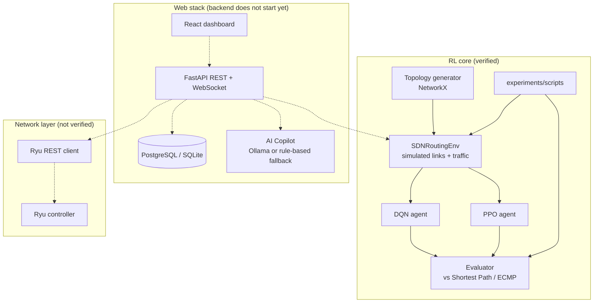

# RL-SDN Traffic Engineering

Reinforcement-learning agents (DQN and PPO) that choose routing paths for flows in a simulated
software-defined network, plus a FastAPI backend and React dashboard around them.

> 🚧 **Work in progress. There are no experimental results yet.**
> The RL agents and a simulated (NetworkX-based) SDN environment are implemented and their unit
> tests pass. The web backend currently fails to start, and integration with a live network
> (Ryu controller, OpenFlow switches, Mininet) has not been built or tested.
> See [STATUS.md](STATUS.md) for exactly what was checked and what works.

[](https://github.com/amirhosseinkho/RL-SDN-Traffic-Engineering/actions)
[](https://www.python.org/downloads/)
[](LICENSE)

---

## What the project does today

1. A topology generator builds a NetworkX graph (linear, tree, fat-tree, spine-leaf or custom JSON).
2. `SDNRoutingEnv` (a Gymnasium environment) simulates link utilization, queueing, latency and
   packet loss on that graph, from a randomly generated and randomly perturbed set of flows.
3. At each step, a DQN or PPO agent picks one of the K shortest paths for every flow, and the
   environment returns a reward that trades off throughput against latency, congestion and loss.
4. An evaluator compares trained agents against shortest-path and ECMP baselines in the same
   simulation.

All of this runs inside the simulation. No routing decision is installed on real or emulated switches.

---

## Architecture

Solid arrows are code paths that exist. Dashed arrows are code that exists but has not been run
successfully (see [STATUS.md](STATUS.md)).



There is no Mininet integration in the code. Live Mininet/Ryu experiments are planned.

---

## Project Structure

```
RL-SDN-Traffic-Engineering/
├── backend/
│   ├── app/
│   │   ├── config.py               # Settings (pydantic-settings)
│   │   ├── main.py                 # FastAPI app factory + lifespan
│   │   ├── api/
│   │   │   ├── routes/             # topology, metrics, flows, rl, reports, copilot
│   │   │   └── websocket.py        # /ws/metrics, /ws/training/{session_id}
│   │   ├── controller/
│   │   │   ├── ryu_controller.py   # Async HTTP client for Ryu's REST API
│   │   │   └── openflow_handler.py # Ryu app (OpenFlow 1.3, L2 learning)
│   │   ├── database/               # SQLAlchemy models, Pydantic schemas, session
│   │   ├── monitoring/
│   │   │   └── collector.py        # Metrics from Ryu, falls back to the simulation
│   │   ├── rl/
│   │   │   ├── environment.py      # SDNRoutingEnv (Gymnasium)
│   │   │   ├── trainer.py          # DQN and PPO training loops
│   │   │   └── agents/
│   │   │       ├── dqn_agent.py    # Dueling Double DQN, uniform replay buffer
│   │   │       └── ppo_agent.py    # PPO (clipped objective, GAE-Lambda)
│   │   ├── simulation/
│   │   │   ├── traffic_generator.py # Traffic patterns (standalone, not used by the env)
│   │   │   └── evaluator.py         # Agent vs baseline comparison
│   │   └── topology/
│   │       └── generator.py        # Linear, tree, fat-tree, spine-leaf, custom JSON
│   ├── tests/
│   │   ├── unit/                   # pytest unit tests
│   │   └── integration/            # API tests (in-memory SQLite)
│   ├── requirements.txt
│   └── Dockerfile
├── frontend/
│   └── src/
│       ├── components/             # TopologyGraph, TrainingChart, MetricsCards, Sidebar
│       ├── pages/                  # 8 dashboard pages
│       ├── services/               # REST + WebSocket clients
│       ├── store/                  # Zustand store
│       └── types/
├── experiments/
│   ├── configs/                    # (empty)
│   └── scripts/
│       ├── train_dqn.py
│       ├── train_ppo.py
│       └── evaluate.py
├── models/                         # Trained weights are written here (git-ignored)
├── docs/                           # architecture.md, training.md
├── STATUS.md                       # What has been verified
├── docker-compose.yml
└── .github/workflows/ci.yml
```

---

## Features

### Implemented and verified
These were exercised by passing unit tests or by running the scripts (see [STATUS.md](STATUS.md)).

- **Topology generator**: linear, tree, fat-tree (k-port) and spine-leaf topologies, with per-link
  bandwidth, latency and loss attributes.
- **`SDNRoutingEnv`** (Gymnasium API):
  - *State*: per-link utilization, latency, packet loss and queue occupancy; per-flow demand and
    active flag; global average/max utilization and congestion ratio.
  - *Action*: multi-discrete, one of the K shortest paths (K = 4 by default) per flow.
  - *Reward*: `w_t·throughput_gain − w_l·latency − w_c·congestion − w_p·packet_loss`.
  - Traffic is synthetic: about 20% elephant flows, random demand perturbations and bursts.
- **DQN agent**: dueling network, Double-DQN targets, uniform experience replay, epsilon-greedy
  exploration, checkpointing.
- **PPO agent**: shared trunk with one policy head per flow, value head, GAE-Lambda advantages,
  clipped surrogate objective.
- **Traffic generator module**: elephant/mice, bursty and gravity-model traffic matrices (tested on
  its own; the RL environment uses its own simpler traffic model).
- **CLI scripts**: `train_dqn.py`, `train_ppo.py` and `evaluate.py` (shortest-path and ECMP
  baselines plus trained agents, results written to JSON).

### Implemented but not verified
The code exists, but it has not run successfully yet.

- **FastAPI backend**: REST routes for topologies, metrics, flows, RL training sessions,
  evaluation, reports and the copilot; WebSocket streams for metrics and training progress.
  *Currently fails to start* (route registration error, see [STATUS.md](STATUS.md)).
- **Custom JSON topologies** in the topology generator (its only unit test currently fails).
- **Report export** in JSON, CSV and PDF (via reportlab).
- **AI Copilot**: sends questions to an Ollama model, and falls back to fixed keyword-based answers
  when Ollama is unavailable.
- **Ryu integration**: an async client for Ryu's REST API (topology, flow and port stats) and an
  OpenFlow 1.3 Ryu app with L2 learning and LLDP-based topology discovery. The metrics collector
  falls back to the simulation when Ryu is unreachable.
- **React dashboard** with 8 pages: Topology, Live Metrics, Active Flows, RL Training, Training
  Progress, Evaluation, Reports, AI Copilot. It bundles with `vite build`, but `tsc` reports type
  errors.

### Planned
- Installing the agents' routing decisions on switches (the `install_path` helpers exist but are
  not called).
- Emulating the network in Mininet and training/evaluating against it.
- Running real experiments and publishing results with their configs and seeds.

---

## Quick Start (RL core only)

This is the part of the project that currently works. Tested on Ubuntu 24.04 (WSL2) with Python 3.12.3.

`backend/requirements.txt` cannot be installed as is, because of a version conflict between
`numpy==2.1.3` and `stable-baselines3==2.4.0` (see [STATUS.md](STATUS.md)). `stable-baselines3` is
not used by the code, so install everything except it:

```bash
git clone https://github.com/amirhosseinkho/RL-SDN-Traffic-Engineering.git
cd RL-SDN-Traffic-Engineering
python3.12 -m venv .venv
source .venv/bin/activate
grep -v stable-baselines3 backend/requirements.txt > /tmp/requirements-rl.txt
pip install -r /tmp/requirements-rl.txt
```

To avoid downloading the CUDA build of PyTorch on a CPU-only machine, first run
`pip install torch==2.5.1 --index-url https://download.pytorch.org/whl/cpu`.

### Train and evaluate from the CLI

Run from the repository root. Trained models are saved to `models/dqn_model.pt` and
`models/ppo_model.pt` (the `--output-dir` flag of `train_dqn.py` is currently ignored).

```bash
# Train DQN on a spine-leaf topology
python experiments/scripts/train_dqn.py \
    --topology spine_leaf --num-switches 6 --num-hosts 8 \
    --timesteps 500000 --lr 1e-4

# Compare DQN with the shortest-path and ECMP baselines on the same topology
python experiments/scripts/evaluate.py \
    --topology spine_leaf --num-switches 6 --num-hosts 8 \
    --dqn-model models/dqn_model.pt \
    --episodes 20 \
    --output results/comparison.json

# Train PPO on a fat-tree topology
python experiments/scripts/train_ppo.py --topology fat_tree --k 4 --timesteps 1000000
```

These commands were checked with much smaller `--timesteps` values. A model can only be evaluated
on the topology it was trained on: the observation size depends on the topology, and loading a
`fat_tree` PPO model into a `spine_leaf` evaluation fails. For `fat_tree` with `k=4`, precomputing
the paths took about 8 minutes before training started.

### Full stack (backend, dashboard, Docker)

Not working yet. The backend fails to import (`app.main`), the frontend type check fails, and
`npm ci` needs a `package-lock.json` that is not committed. The intended entry points are
`docker compose up -d` (dashboard on port 3000, API docs at `/api/v1/docs` on port 8000) and
`uvicorn app.main:app` from `backend/`. See [STATUS.md](STATUS.md) for the specific errors.

---

## Results

The evaluation pipeline (DQN vs PPO vs Shortest Path vs ECMP, measuring reward, latency,
throughput, packet loss and convergence time) exists and runs, but **no experiments have been run
yet**. Results will be added here together with the configs and seeds needed to reproduce them.

---

## API Reference (defined, not yet runnable)

These routes are defined in `backend/app/api/`, under the `/api/v1` prefix. The backend does not
start at the moment, so none of them have been tested.

```
POST   /api/v1/topology/                    Create topology
GET    /api/v1/topology/                    List topologies
GET    /api/v1/topology/{id}                Get topology
GET    /api/v1/topology/{id}/graph          Graph data for visualization
POST   /api/v1/topology/{id}/activate       Set active topology
DELETE /api/v1/topology/{id}                Delete topology

GET    /api/v1/metrics/summary              Current network summary
GET    /api/v1/metrics/links                Per-link metrics
GET    /api/v1/metrics/{id}/history         Link metric history
GET    /api/v1/metrics/{id}/congestion      Congestion heatmap

GET    /api/v1/flows/                       List flows
GET    /api/v1/flows/ryu                    Flows reported by Ryu
POST   /api/v1/flows/install                Record a flow (database only)
DELETE /api/v1/flows/{flow_id}              Remove flow
GET    /api/v1/flows/stats/summary          Flow statistics

POST   /api/v1/rl/train                     Start training session
POST   /api/v1/rl/train/{id}/stop           Stop training
GET    /api/v1/rl/sessions                  List sessions
GET    /api/v1/rl/sessions/{id}             Training progress
POST   /api/v1/rl/evaluate                  Run evaluation
GET    /api/v1/rl/compare/{topology_id}     Comparison results

POST   /api/v1/reports/generate             Export report (json / csv / pdf)

POST   /api/v1/copilot/query                Ask a network question
GET    /api/v1/copilot/history              Query history

WS     /ws/metrics                          Live metrics stream
WS     /ws/training/{session_id}            Training progress stream
```

---

## Testing

```bash
cd backend
pytest tests/unit/ -v --no-cov
```

Current state ([STATUS.md](STATUS.md)): 40 of 41 unit tests pass (`test_custom_topology` fails). The
coverage threshold in `pytest.ini` (`--cov-fail-under=70`) is not met, so a plain `pytest` run exits
with an error. The integration tests (`tests/integration/`, in-memory SQLite, need `aiosqlite`) fail
at collection because `app.main` cannot be imported.

---

## Tech Stack

| Layer | Technology |
|-------|-----------|
| RL | PyTorch, Gymnasium, NumPy |
| Graph / simulation | NetworkX |
| Backend | Python 3.12, FastAPI, SQLAlchemy (async), asyncpg |
| Controller (not verified) | Ryu REST API client, OpenFlow 1.3 Ryu app |
| Frontend | React 18, TypeScript, TailwindCSS, Zustand |
| Charts | Recharts, D3.js |
| AI Copilot (not verified) | Ollama |
| Deployment (not verified) | Docker, Docker Compose |
| CI | GitHub Actions |

---

## License

MIT License. See [LICENSE](LICENSE).

---

## Citation

If you refer to this software, you can cite the repository:

```bibtex
@software{rl_sdn_traffic_engineering,
  title  = {RL-SDN Traffic Engineering},
  author = {Amirhossein Khoshbakht},
  year   = {2026},
  url    = {https://github.com/amirhosseinkho/RL-SDN-Traffic-Engineering}
}
```
